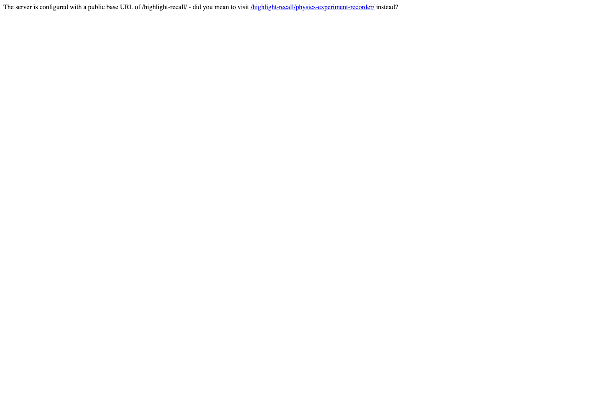
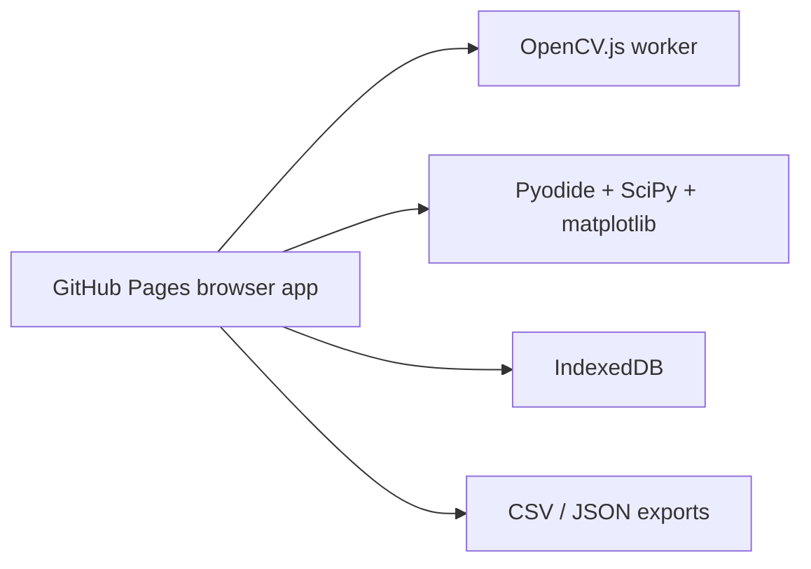

# Physics Experiment Recorder


Live site:

https://baditaflorin.github.io/physics-experiment-recorder/

Repository:

https://github.com/baditaflorin/physics-experiment-recorder

Support:

https://www.paypal.com/paypalme/florinbadita

Physics Experiment Recorder turns phone video of tagged motion experiments into
position-vs-time data, curve fits, and reproducible exports in a static browser
app.



## Quickstart

```sh
npm install
make install-hooks
make dev
make smoke
```

## What It Does

- Imports demo data, CSV tracks, or phone video.
- Tracks a high-contrast AprilTag-style square marker with OpenCV.js.
- Converts pixels to meters from printed tag size.
- Infers pendulum, falling-object, or cart-like motion.
- Fits models with JavaScript or Pyodide/SciPy and plots results.
- Exports CSV tracks and JSON experiment records with provenance.

## Architecture



Architecture docs:

https://github.com/baditaflorin/physics-experiment-recorder/blob/main/docs/architecture.md

ADRs:

https://github.com/baditaflorin/physics-experiment-recorder/tree/main/docs/adr

Deploy guide:

https://github.com/baditaflorin/physics-experiment-recorder/blob/main/docs/deploy.md
