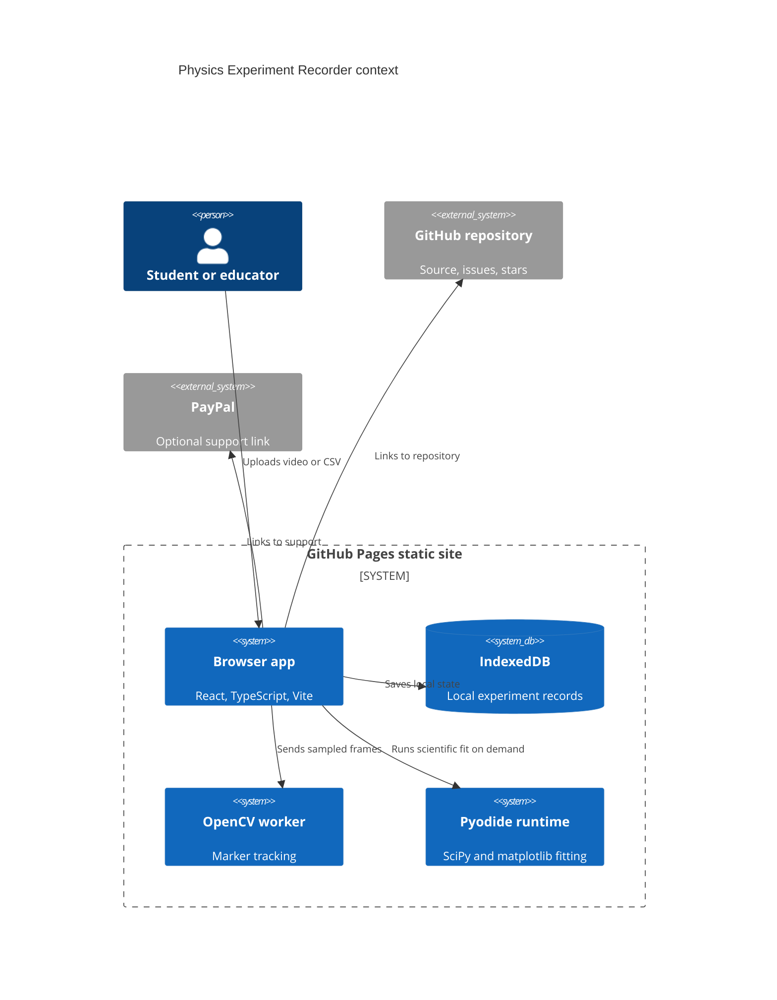
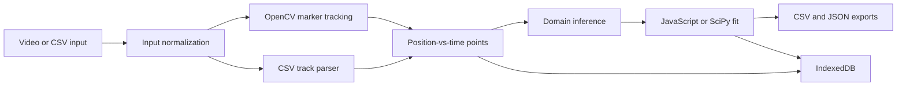

# Architecture

Physics Experiment Recorder is a Mode A static GitHub Pages app.

The GitHub Pages boundary is explicit: no runtime server, database, auth service,
or secret-bearing API is called by the app.
